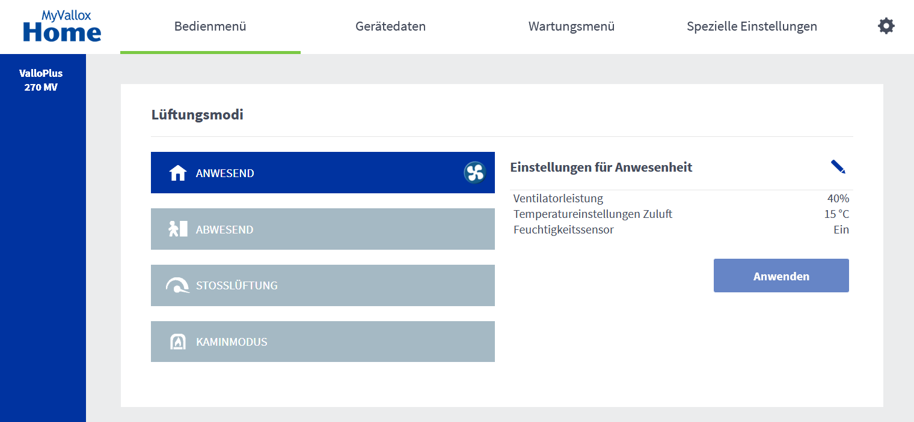

<p align="center">


</p>


# Homebridge Vallox Plugin



This pluging adds your Vallox ventilation unit to HomeKit.

Tested with ValloPlus 270 MV.

## Install Development Dependencies

Using a terminal, navigate to the project folder and run this command to install the development dependencies:

```
npm install
```

## Build Plugin

TypeScript needs to be compiled into JavaScript before it can run. The following command will compile the contents of your [`src`](./src) directory and put the resulting code into the `dist` folder.

```
npm run build
```

## Link To Homebridge

Run this command so your global install of Homebridge can discover the plugin in your development environment:

```
npm link
```

You can now start Homebridge, use the `-D` flag so you can see debug log messages in your plugin:

```
homebridge -D
```

## Versioning Your Plugin

Given a version number `MAJOR`.`MINOR`.`PATCH`, such as `1.4.3`, increment the:

1. **MAJOR** version when you make breaking changes to your plugin,
2. **MINOR** version when you add functionality in a backwards compatible manner, and
3. **PATCH** version when you make backwards compatible bug fixes.

You can use the `npm version` command to help you with this:

```bash
# major update / breaking changes
npm version major

# minor update / new features
npm version update

# patch / bugfixes
npm version patch
```

## Publish Package

When you are ready to publish your plugin to [npm](https://www.npmjs.com/), make sure you have removed the `private` attribute from the [`package.json`](./package.json) file then run:

```
npm publish
```

If you are publishing a scoped plugin, i.e. `@username/homebridge-xxx` you will need to add `--access=public` to command the first time you publish.
